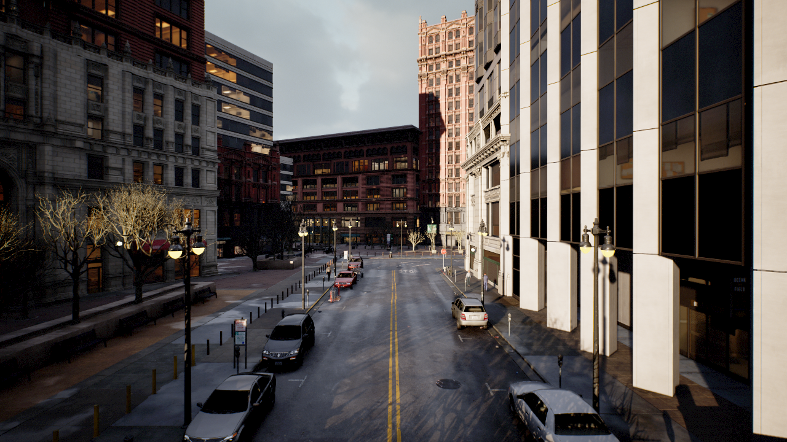
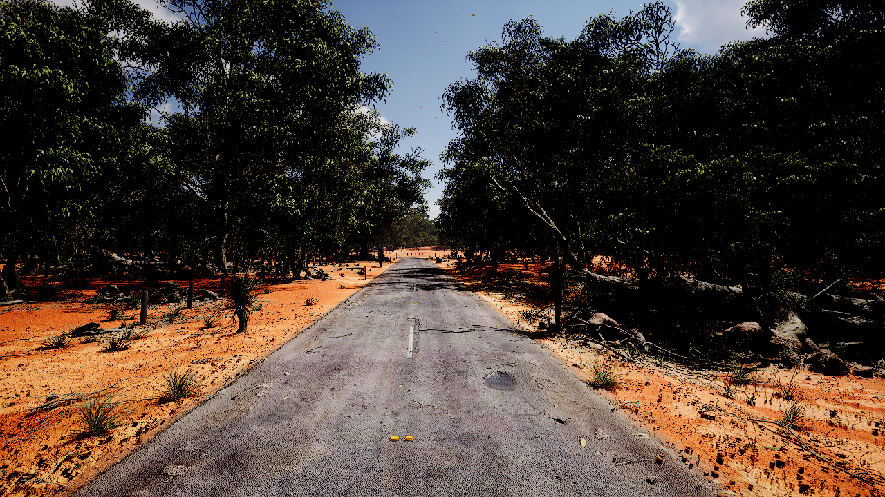

# NeuFlow

Official PyTorch implementation of paper:

[NeuFlow: Real-time, High-accuracy Optical Flow Estimation on Robots Using Edge Devices](NeuFlow.pdf)

Authors: [Zhiyong Zhang](https://www.linkedin.com/in/zhiyong-zhang-0772a0159/), [Huaizu Jiang](https://jianghz.me/), [Hanumant Singh](https://scholar.google.com/citations?user=1UEU5PEAAAAJ)

## Coming Soon!

To enhance NeuFlow's real-world performance, we are currently collecting new optical flow data featuring photorealistic images and precise optical flow ground truth. Stay tuned for the release of the dataset and trained model!


<table align="center">
  <tr>
    <td> 
      
    </td>
    <td> 
      
    </td>
  </tr>
</table>

## Installation (PyTorch >= 2.0 is required)

```
conda create --name neuflow python==3.8
conda activate neuflow
conda install pytorch==2.0.1 torchvision==0.15.2 pytorch-cuda=11.7 -c pytorch -c nvidia
pip install numpy opencv-python
```

[Pytorch-Correlation-extension 0.4.0](https://github.com/ClementPinard/Pytorch-Correlation-extension/tree/0.4.0) (Recommend to build from source)

```
git clone -b 0.4.0 https://github.com/ClementPinard/Pytorch-Correlation-extension.git
cd Pytorch-Correlation-extension/
python setup.py install
```

## Datasets

The datasets used to train and evaluate NeuFlow are as follows:

* [FlyingChairs](https://lmb.informatik.uni-freiburg.de/resources/datasets/FlyingChairs.en.html#flyingchairs)
* [FlyingThings3D](https://lmb.informatik.uni-freiburg.de/resources/datasets/SceneFlowDatasets.en.html)
* [Sintel](http://sintel.is.tue.mpg.de/)
* [KITTI](http://www.cvlibs.net/datasets/kitti/eval_scene_flow.php?benchmark=flow)
* [HD1K](http://hci-benchmark.iwr.uni-heidelberg.de/) 

By default the dataloader assumes the datasets are located in folder `datasets` and are organized as follows:

```
datasets
├── FlyingChairs_release
│   └── data
├── FlyingThings3D
│   ├── frames_cleanpass
│   ├── frames_finalpass
│   └── optical_flow
├── HD1K
│   ├── hd1k_challenge
│   ├── hd1k_flow_gt
│   ├── hd1k_flow_uncertainty
│   └── hd1k_input
├── KITTI
│   ├── testing
│   └── training
├── Sintel
│   ├── test
│   └── training
```

Symlink your dataset root to `datasets`:

```shell
ln -s $YOUR_DATASET_ROOT datasets
```

## Training

We trained the model for approximately a week, using a single RTX 4090 GPU and an i9-13900K CPU to achieve the accuracy reported in the paper. (The CPU played a crucial role, particularly as loading images might have been the bottleneck.)

```
python train.py \
--checkpoint_dir $YOUR_CHECKPOINT_DIR \
--stage things \
--val_dataset things sintel \
--batch_size 64 \
--num_workers 8 \
--lr 2e-4 \
--weight_decay 1e-4 \
--val_freq 2000 \
--max_flow 400
```

## Optional

Write occlusion files for FlyingThings3D to prevent minimal overlap between image pairs during training.
```
python write_occ.py
```

## Evaluation

```
python eval.py \
--resume neuflow_things.pth
```
